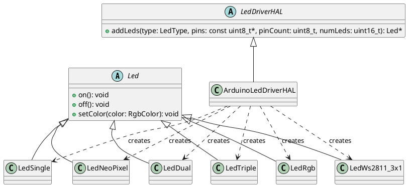

```plantuml
@startuml

abstract class Led {
  + on(): void
  + off(): void
  + setColor(color: RgbColor): void
}

class LedSingle extends Led
class LedDual extends Led
class LedTriple extends Led
class LedRgb extends Led
class LedNeoPixel extends Led
class LedWs2811_3x1 extends Led

abstract class LedDriverHAL {
  + addLeds(type: LedType, pins: const uint8_t*, pinCount: uint8_t, numLeds: uint16_t): Led*
}

class ArduinoLedDriverHAL extends LedDriverHAL

ArduinoLedDriverHAL ..> LedSingle : creates
ArduinoLedDriverHAL ..> LedDual : creates
ArduinoLedDriverHAL ..> LedTriple : creates
ArduinoLedDriverHAL ..> LedRgb : creates
ArduinoLedDriverHAL ..> LedNeoPixel : creates
ArduinoLedDriverHAL ..> LedWs2811_3x1 : creates

@enduml
```
