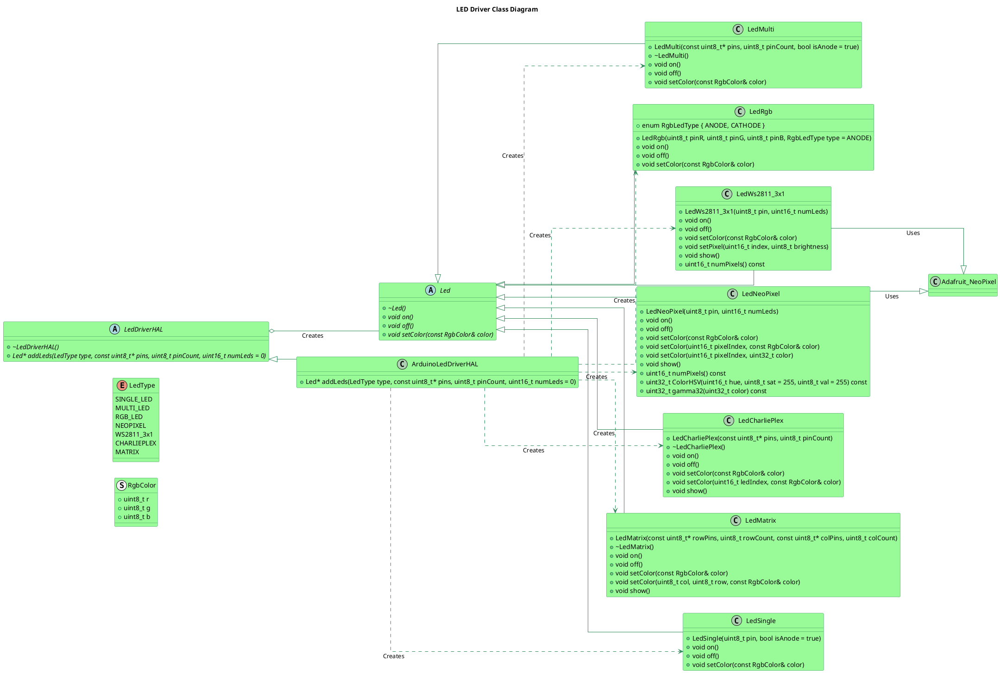

# Class Diagram

This diagram illustrates the class structure of the `xDuinoRails_LED-Drivers` library.

```plantuml
@startuml
title LED Driver Class Diagram

left to right direction

' Styling
skinparam class {
    BackgroundColor PaleGreen
    ArrowColor SeaGreen
    BorderColor SeaGreen
}
skinparam linetype ortho

' Enums and Structs
struct RgbColor {
    + uint8_t r
    + uint8_t g
    + uint8_t b
}

enum LedType {
    SINGLE_LED
    MULTI_LED
    RGB_LED
    NEOPIXEL
    WS2811_3x1
    CHARLIEPLEX
    MATRIX
}

' Abstract Base Classes (Interfaces)
abstract class Led {
    + {abstract} ~Led()
    + {abstract} void on()
    + {abstract} void off()
    + {abstract} void setColor(const RgbColor& color)
}

abstract class LedDriverHAL {
    + {abstract} ~LedDriverHAL()
    + {abstract} Led* addLeds(LedType type, const uint8_t* pins, uint8_t pinCount, uint16_t numLeds = 0)
}

' Concrete HAL Implementation
class ArduinoLedDriverHAL extends LedDriverHAL {
    + Led* addLeds(LedType type, const uint8_t* pins, uint8_t pinCount, uint16_t numLeds = 0)
}

' Concrete LED Implementations
class LedSingle extends Led {
    + LedSingle(uint8_t pin, bool isAnode = true)
    + void on()
    + void off()
    + void setColor(const RgbColor& color)
}

class LedMulti extends Led {
    + LedMulti(const uint8_t* pins, uint8_t pinCount, bool isAnode = true)
    + ~LedMulti()
    + void on()
    + void off()
    + void setColor(const RgbColor& color)
}

class LedRgb extends Led {
    + enum RgbLedType { ANODE, CATHODE }
    + LedRgb(uint8_t pinR, uint8_t pinG, uint8_t pinB, RgbLedType type = ANODE)
    + void on()
    + void off()
    + void setColor(const RgbColor& color)
}

class LedNeoPixel extends Led {
    + LedNeoPixel(uint8_t pin, uint16_t numLeds)
    + void on()
    + void off()
    + void setColor(const RgbColor& color)
    + void setColor(uint16_t pixelIndex, const RgbColor& color)
    + void setColor(uint16_t pixelIndex, uint32_t color)
    + void show()
    + uint16_t numPixels() const
    + uint32_t ColorHSV(uint16_t hue, uint8_t sat = 255, uint8_t val = 255) const
    + uint32_t gamma32(uint32_t color) const
}

class LedWs2811_3x1 extends Led {
    + LedWs2811_3x1(uint8_t pin, uint16_t numLeds)
    + void on()
    + void off()
    + void setColor(const RgbColor& color)
    + void setPixel(uint16_t index, uint8_t brightness)
    + void show()
    + uint16_t numPixels() const
}

class LedCharliePlex extends Led {
    + LedCharliePlex(const uint8_t* pins, uint8_t pinCount)
    + ~LedCharliePlex()
    + void on()
    + void off()
    + void setColor(const RgbColor& color)
    + void setColor(uint16_t ledIndex, const RgbColor& color)
    + void show()
}

class LedMatrix extends Led {
    + LedMatrix(const uint8_t* rowPins, uint8_t rowCount, const uint8_t* colPins, uint8_t colCount)
    + ~LedMatrix()
    + void on()
    + void off()
    + void setColor(const RgbColor& color)
    + void setColor(uint8_t col, uint8_t row, const RgbColor& color)
    + void show()
}

' Relationships
LedDriverHAL o-- Led : Creates
ArduinoLedDriverHAL ..> LedSingle : Creates
ArduinoLedDriverHAL ..> LedMulti : Creates
ArduinoLedDriverHAL ..> LedRgb : Creates
ArduinoLedDriverHAL ..> LedNeoPixel : Creates
ArduinoLedDriverHAL ..> LedWs2811_3x1 : Creates
ArduinoLedDriverHAL ..> LedCharliePlex : Creates
ArduinoLedDriverHAL ..> LedMatrix : Creates

LedNeoPixel --|> Adafruit_NeoPixel : Uses
LedWs2811_3x1 --|> Adafruit_NeoPixel : Uses

@enduml
```
