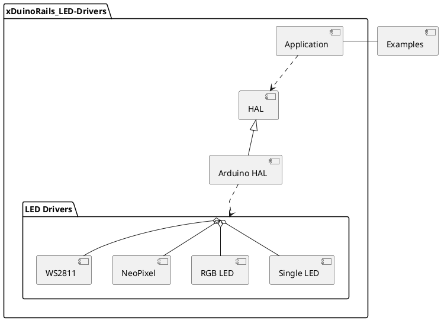

```plantuml
@startuml

package "xDuinoRails_LED-Drivers" {
  [Application] ..> [HAL]
  [HAL] <|-- [Arduino HAL]
  [Arduino HAL] ..> [LED Drivers]

  package "LED Drivers" {
    [LED Drivers] o-- [Single LED]
    [LED Drivers] o-- [RGB LED]
    [LED Drivers] o-- [NeoPixel]
    [LED Drivers] o-- [WS2811]
  }
}

[Application] - [Examples]

@enduml
```
